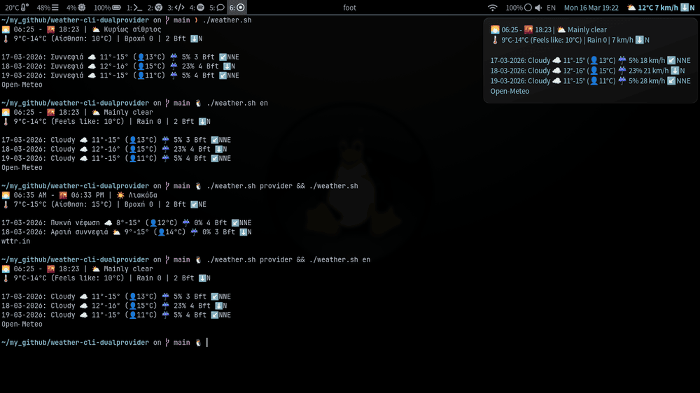

### weather-cli-dualprovider
---



## Features
- **Dual providers**: Open‑Meteo and wttr.in with automatic fallback on API errors.  
- **Why dual providers**: Open‑Meteo generally provides **more accurate forecasts**, while **wttr.in** can deliver **more accurate current conditions** when there is a nearby weather station.  
- **Emoji icons** for quick visual weather cues.  
- **Localization**: Greek and English provided; additional locales supported via `locales/`.  
- **Wind units**: **Beaufort**, **km/h**, and **knots** (displayed as **kt**).  
- **Wind direction arrows** using a 16‑point compass.  
- **Waybar JSON output** compatible with Waybar modules.  
- **Interactive Waybar module**: **Left-click** to instantly toggle the weather provider, and **Right-click** to cycle through wind units (Beaufort, km/h, knots).
- **CLI and lock screen friendly**: works in desktop Linux, Termux, TTY, SSH, Waybar, and Hyprland/hyprlock.  
- **Forecast tooltip** with sunrise/sunset, min/max, feels like, and rain probability.  
- **Per‑user persistent state** stored under **`~/.cache/weather`** by default.
---

## Requirements

- **bash** (POSIX shell compatible)
- **curl**
- **jq**
- **awk**
- **GNU date** (coreutils date; macOS users may need `gdate` from coreutils)
- **Optional**: Waybar for JSON module integration

**Emoji and fonts**
- For best emoji rendering install **Google Noto Color Emoji**.
- Fallback font: **JetBrains Mono**.
- Terminal rendering depends on compositor and fontconfig (e.g., Hyprland).

**Make script executable**
- Ensure the script is executable:
```bash
chmod +x ~/.config/waybar/scripts/weather/weather.sh
```

---

## Installation and Configuration
**Install script**
```bash
mkdir -p ~/.config/waybar/scripts/weather
cp weather.sh ~/.config/waybar/scripts/weather/weather.sh
cp -r locales ~/.config/waybar/scripts/weather/locales
chmod +x ~/.config/waybar/scripts/weather/weather.sh
```

**Defaults (edit top of script)**
- **DEFAULT_PROVIDER** — `"wttr"` or `"open-meteo"`.  
- **DEFAULT_WIND** — `"bft"`, `"knots"`, or `"kmh"`.  
- **FORECAST_DAYS** — number of future days shown in tooltip (Open‑Meteo only).  
- **LAT** and **LON** — coordinates for Open‑Meteo queries.
- **LOCATION** — location for wttr.in (city name in English or "lat,lon"; default: Chios, Greece).
- **DATE_FORMAT** — Visual style (e.g., `"%a %d"` for **Fri 03**).
- **DATE_LOCALE** — Leave empty for Smart Auto-Discovery (matches language automatically).

| Format | Output Example |
| :--- | :--- |
| `"%a %d"` | **Fri 03** / **Παρ 03** (Compact) |
| `"%d-%m-%Y"` | **03-04-2026** (Full) |

> **Note:** The script automatically finds the best UTF-8 locale (e.g., el_GR.UTF-8) based on your language. If dates appear as ???, ensure that specific locale is generated on your system (locale -a).

### Locale files

Locale files live in `locales/` and are named `weather.<lang>`. The script derives **WEATHER_LANG** from your `LANG` environment (first two characters) and falls back to `en` if unset.

**Each locale file must provide**
- **`declare -A DESC_FOR_WMO=(...)`** — map WMO weather codes to localized short descriptions.  
- **`LABEL_*` variables** — UI labels used throughout the script (e.g., `LABEL_FEELS`, `LABEL_RAIN`, `LABEL_PROVIDER_WTTR`).  
- **`LABEL_UNKNOWN`** — final localized fallback when no description is available.

**Provider behavior**
- **Open‑Meteo**: returns numeric WMO codes only; the script **relies on `DESC_FOR_WMO`** to produce human text.  
- **wttr.in**: may return localized `lang_xx` fields; the script **prefers `lang_${WEATHER_LANG}`**, falls back to `weatherDesc` (English), then to `DESC_FOR_WMO` / `LABEL_UNKNOWN`.

**Tip**
- Name locale files using the two‑letter code the script derives (for example `weather.en`, `weather.el`) so they are picked up automatically.

**Creating a new translation**

To add a new language, simply copy `locales/weather.en` to `locales/weather.<lang>`  
(for example `weather.fr`, `weather.de`, `weather.it`) and translate the values.  
No script changes are required — the script automatically detects and loads any
`weather.<lang>` file as long as it contains valid shell code and defines the same
variables as the English template.

> **Note about toggle commands**  
> The `provider` and `wind_mode` commands only change internal state files and do not print weather text. They do **not** use `WEATHER_LANG` or locale files. If you chain a toggle with a display call, remember the temporary env prefix applies only to the simple command it precedes. Example:
> ```bash
> # toggle provider (no localization needed)
> # The script derives WEATHER_LANG from the environment (WEATHER_LANG → LANG → en).
> weather.sh provider
>
> # force weather in English (language matters here)
> WEATHER_LANG=en weather.sh
> weather.sh en
>
> # or force English for chained calls
> # Toggles do not produce localized output — set `WEATHER_LANG` only for display invocations.
> weather.sh provider && weather.sh -l en
> ```
---

## Waybar and Hyprland Integration
**Waybar module example**

*Tip: With the `on-click` actions below, **LMB** toggles the provider and **RMB** cycles wind units.*

```json
"custom/weather": {
  "format": "{}",
  "interval": 600,
  "exec": "~/.config/waybar/scripts/weather/weather.sh",
  "return-type": "json",
  "on-click": "~/.config/waybar/scripts/weather/weather.sh provider",
  "on-click-right": "~/.config/waybar/scripts/weather/weather.sh wind_mode"
}
```

**Waybar CSS example**
```css
#custom-weather {
  padding: 0 10px;
  color: #87ceeb;
  font-weight: bold;
}
```

**Hyprland / hyprlock usage**
- Use absolute paths to avoid environment differences when the lock process runs.
- **Show short text.** Hyprlock does not support separate tooltip fields. 
```ini
label {
    monitor =
    text = cmd[update:600000] ~/.config/waybar/scripts/weather/weather.sh | jq -r '.text'
    font_size = 20
    font_family = JetBrains Mono
    color = rgba(180,220,255,1.0)
    position = 0, 120
    halign = center
    valign = center
}
```

### Advanced Usage: Automating Screen Gamma (hyprsunset)

Because this script outputs detailed terminal text, you can parse it to extract your exact local sunrise (`🌅`) and sunset (`🌇`) times. 

We have provided a complete example of how to use this feature to **dynamically generate a smooth, 1-hour day/night transition** for your screen's color temperature using `hyprsunset` and `systemd` timers.

👉 **[Check out the advanced hyprsunset automation guide and scripts here!](./examples/hyprsunset-automation/)**

---

### Forcing a Language and CLI Usage

**CLI usage**  

- **Show tooltip / Waybar JSON**
```bash
~/.config/waybar/scripts/weather/weather.sh
```

**Force a language with `WEATHER_LANG`**
- **English**
```bash
WEATHER_LANG=en ~/.config/waybar/scripts/weather/weather.sh
```
- **Greek**
```bash
WEATHER_LANG=el ~/.config/waybar/scripts/weather/weather.sh
```

**Using CLI override (Language & Provider)**
You can force the script to use a specific language or provider for a single run without changing your saved toggles.
```bash
./weather.sh en
./weather.sh -l en
./weather.sh --lang=en

# Force provider
./weather.sh -p wttr
./weather.sh --provider=open-meteo

# Combine both
./weather.sh -p open-meteo en

# Forecast flag
./weather.sh -f 8            # show 8 future days (Open‑Meteo only)
./weather.sh --forecast=5    # same, using long form
# numeric positional also supported:
./weather.sh en 8            # language en, 8 forecast days

```

**Toggling states**
- **Toggle provider**
```bash
~/.config/waybar/scripts/weather/weather.sh provider
```
- **Cycle wind units**
```bash
~/.config/waybar/scripts/weather/weather.sh wind_mode
```

**Auto provider switch on API error**  
- The script attempts an **automatic provider switch** when a provider returns no data or an error **only if** the script detects it is running in a terminal (`TERMINAL_MODE=true`, i.e., `-t 1` is true). In that case the script writes the alternate provider to the provider state file and re‑executes itself in terminal mode, printing a short warning like:
```
⚠️  API Error or Invalid Location — switching provider from wttr.in to Open‑Meteo ...
```
- If the script is **not** running in a terminal (for example when Waybar or another bar runs it), it **does not** auto‑switch; instead it emits a minimal JSON error (`{"text":"API Error"}`) and exits.  
- **Implication:** when using the script from a bar/daemon, prefer explicit provider toggles or restart the module if you want a provider change after an API failure.

---

## Acknowledgments / Data Providers

This project would not be possible without the free access provided by these excellent weather APIs. If you use this script, please respect their API usage policies.

* **[Open-Meteo](https://open-meteo.com/)**: Weather data and forecasts provided by Open-Meteo.com under the CC BY 4.0 license.
* **[wttr.in](https://wttr.in/)**: The right way to check the weather, created and maintained by Igor Chubin.

## License

This project is licensed under the **GNU General Public License v3.0**.  
You can find the full license text in the[LICENSE](LICENSE) file.
