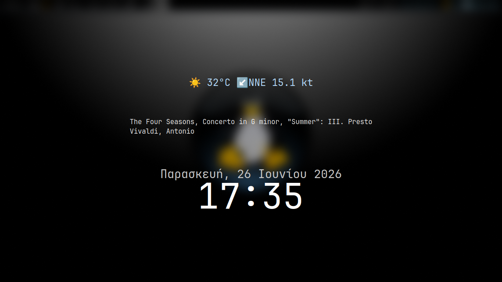

# Weather CLI - Hyprlock Integration Example

This example demonstrates how to create a beautiful, dynamic lock screen using `hyprlock` that displays live weather data from `weather.sh`, a system clock, and current media status from `mpv`.

<p align="center">
  
</p>

## Features
* **Live Weather:** Updates every 10 minutes using `weather.sh`.
* **Dynamic Media Status:** Displays "Now Playing" tracks via an active `mpv` instance.
* **Aesthetics:** Uses a blurred live screenshot as a background with crisp `JetBrains Mono` typography.

---

## Requirements & Dependencies

To make this setup work, you need the following tools installed on your system:

1. **Hyprlock:** The screen locker itself (`hyprlock`).
2. **JQ:** Used to parse the raw JSON data from the weather script (`jq`).
3. **Netcat:** Required by the MPV script to query the local socket (`openbsd-netcat` or equivalent with `-U` support).
4. **Font:** `JetBrains Mono` (ensure it is installed via your package manager).

---

## Installation & Configuration

### 1. Copy the Scripts
Move the provided scripts to your preferred scripts directory (e.g., `~/.config/hypr/scripts/`). 

### 2. Update Paths in `hyprlock.conf`
Open the provided `hyprlock.conf` and look for the **Weather** and **Now Playing** blocks. Update the paths to point to exactly where your scripts live:

```ini
# Weather Label
text = cmd[update:600000] /path/to/your/weather.sh | jq -r '.text'

# MPV Label
text = cmd[update:5000] /path/to/your/mpv-title.sh

```

### 3. Enable MPV IPC Sockets

The `mpv-title.sh` script relies on `mpv` communicating over a UNIX socket. You must add the following line to your `~/.config/mpv/mpv.conf`:

```ini
input-ipc-server=/tmp/mpv-socket

```

---

## Usage

Test your configuration by running:

```bash
hyprlock --config ./hyprlock.conf

```
